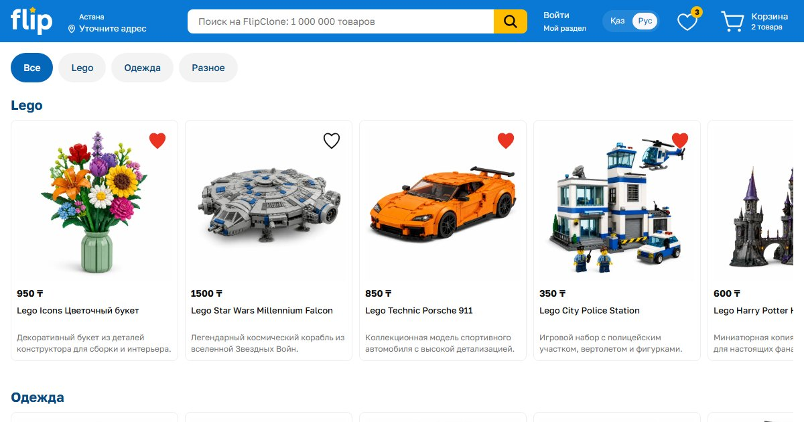

# FlipClone

Учебный frontend-клон части интерфейса [Flip.kz](https://www.flip.kz/). Проект создан для практики React, TypeScript, адаптивной вёрстки и компонентной архитектуры.

**Демо:** [flip-kz-clone.vercel.app](https://flip-kz-clone.vercel.app/)



> [!IMPORTANT]
> Проект находится в разработке. Сейчас это frontend-интерфейс без backend, API и полноценной логики интернет-магазина.

## Что реализовано

- header для desktop, tablet и mobile;
- burger menu с закрытием по `Escape`, удержанием фокуса внутри меню, возвратом фокуса и блокировкой прокрутки страницы;
- dropdown авторизации с открытием с клавиатуры и закрытием по `Escape` с возвратом фокуса;
- затемнение фона при открытом меню;
- каталог из 20 карточек товаров в разделах Lego, «Одежда» и «Разное»;
- горизонтальная прокрутка карточек первых двух разделов и сетка третьего;
- фильтр по категориям с выбором нескольких разделов, кнопкой «Все» и доступным состоянием кнопок через `aria-pressed`;
- поиск внутри выбранных категорий по части названия товара или раздела без учёта регистра и пробелов по краям, с кнопкой очистки и сообщением об отсутствии результатов;
- общее значение поиска для мобильной и десктопной шапки;
- избранное: добавление и удаление товара кнопкой на карточке, подпись кнопки для скринридера содержит название товара;
- счётчик избранного в шапке: скрыт при нуле, количество озвучивается скринридером на русском и казахском;
- русский и казахский языки для шапки, футера, кнопок категорий и сообщения об отсутствии результатов, синхронизированные переключатели языка;
- адаптивный footer с сеткой ссылок, соцсетями, блоком с QR на десктопе и отдельными ссылками App Store / Google Play на мобильных устройствах;
- переиспользуемые UI- и layout-компоненты;
- строгая типизация TypeScript для исходного кода;
- автоматические проверки ESLint, TypeScript и сборки через GitHub Actions.

Каталог и кнопки категорий используют общий набор локальных данных. При снятии всех выбранных категорий или выборе всех трёх включается режим «Все». Поиск продолжает учитывать введённый запрос.

Названия разделов каталога, названия и описания товаров пока на русском языке, часть ссылок остаётся заглушками.

## Технологии

- React 19;
- TypeScript;
- Next.js 16 (App Router), пока в режиме статического экспорта;
- SCSS Modules;
- i18next и react-i18next;
- ESLint;
- SVGR;
- React Icons;
- React Focus Lock.

## Требования

- Node.js 24 — эта версия используется в CI;
- npm.

## Запуск

```bash
git clone https://github.com/mrcomhon/flip-kz-clone.git
cd flip-kz-clone
npm install
npm run dev
```

После запуска сайт доступен по адресу `http://localhost:3000`.

## Проверки

```bash
npm test
```

Команда последовательно запускает ESLint, проверку типов TypeScript и production-сборку. Отдельных автоматических тестов поведения пока нет.

В GitHub Actions эти же проверки запускаются при открытии и обновлении pull request в `main`, а также при push в `main`. Workflow [`.github/workflows/ci.yml`](.github/workflows/ci.yml) использует Ubuntu и Node.js 24, устанавливает зависимости через `npm ci` и выполняет `npm test`.

| Команда             | Назначение                              |
| ------------------- | --------------------------------------- |
| `npm run dev`       | запуск dev-сервера Next.js               |
| `npm test`          | lint, проверка типов и сборка            |
| `npm run typecheck` | генерация типов Next.js и проверка типов |
| `npm run lint`      | проверка кода ESLint                     |
| `npm run build`     | production-сборка в папку `dist`         |
| `npm run preview`   | локальный просмотр сборки из `dist`      |

## Деплой

Сайт развёрнут на [Vercel](https://vercel.com/). Каждый merge в `main` публикуется автоматически, для pull request создаётся отдельная ссылка для предпросмотра.

## Структура

```text
public/           # иконки сайта и картинка для превью ссылки
src/
├── app/          # точка входа Next.js: общий layout и страницы
├── assets/       # иконки, шрифты и изображения
├── components/   # React-компоненты
├── data/         # локальные данные каталога и категорий
├── hooks/        # пользовательские React-хуки
├── i18n/         # настройка переводов и локали ru/kk
├── styles/       # глобальные стили и SCSS-хелперы
├── types/        # общие объявления типов
└── views/        # содержимое страниц
```

## План развития

- добавить subheader;
- создать страницы товаров;
- добавить страницу избранного и сохранение выбора после перезагрузки;
- добавить логику корзины и авторизации;
- добавить автоматические тесты поведения интерфейса.

## Дисклеймер

Этот репозиторий создан исключительно в учебных целях, не связан с Flip.kz и не является официальным продуктом.
